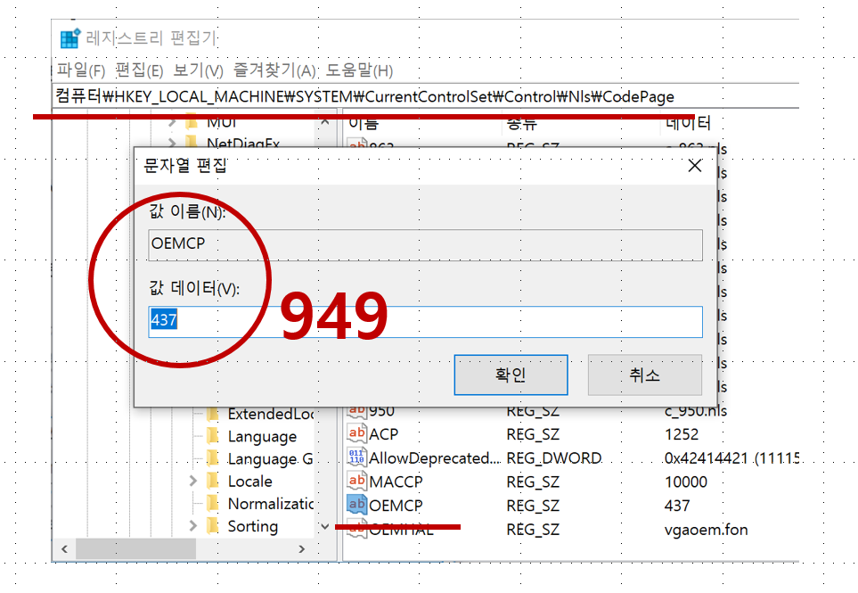

# OS

1. Linux
1. Windows

## 콘솔에서 한글 깨짐 해결하기

- regedit 프로그램
  - 컴퓨터\HKEY_LOCAL_MACHINE\SYSTEM\CurrentControlSet\Control\Nls\CodePage
  - OEMCP : 949  또는 65001
    - 949 : 한국어
    - 65001 : UTF-8   
      
  - chcp 명령어로 확인하기
    ```shell
    chcp      // 확인하기
    chcp 949  // 변경하기
    ```