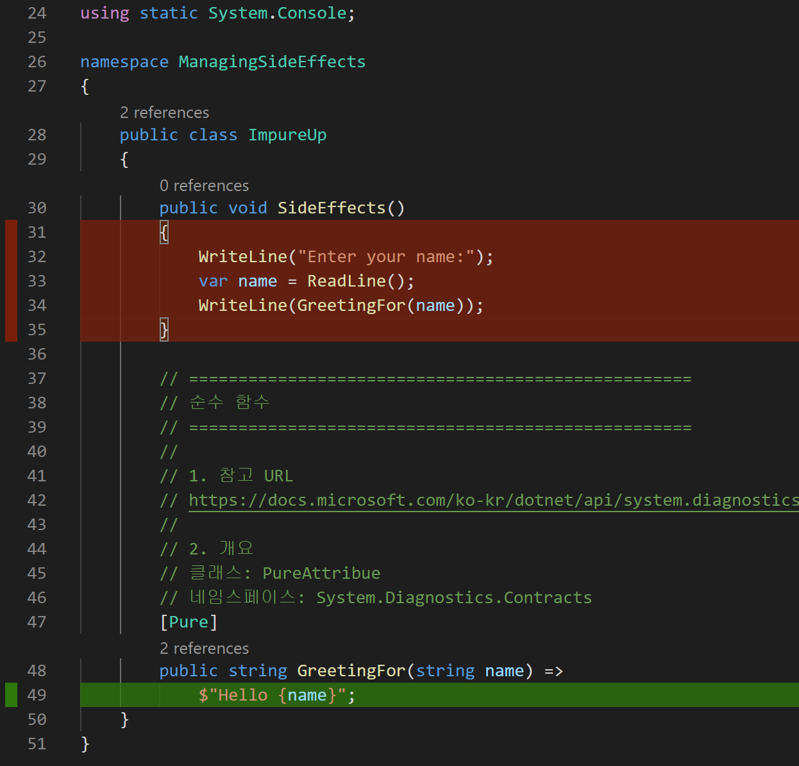

# Managing Side Effects

## 목표
- 순수 함수와 불순 함수를 분리한다.
- 순수 함수는 [Pure]로 명시한다.

## 과제
1. 불순 함수(I/O)
   ```cs
        public void SideEffects()
        {
            WriteLine("Enter your name:");
            var name = ReadLine();
            WriteLine($"Hello {name}");
        }   
   ```
1. 불순함수 분리하기

## 따라하기
1. 프로젝트 만들기
   - ```dotnet new console -o .\Ch02\Step1\ManagingSideEffects```
   - ```dotnet new xunit -o.\Ch02\Step1\ManagingSideEffects.Tests```
1. 프로젝트 참조하기
   - ```dotnet add .\Ch02\Step2\ManagingSideEffects.Tests reference .\Ch02\Step2\ManagingSideEffects```
3. 프로젝트 추가하기
   - ```dotnet sln add .\Ch02\Step1\ManagingSideEffects```
   - ```dotnet sln add .\Ch02\Step1\ManagingSideEffects.Tests```
4. 패키지 참조하기
   - ```dotnet add .\Ch02\Step1\ManagingSideEffects.Tests package FluentAssertions```
5. VSCode 확장 도구 설치하기
   - .NET Core Test Explorer
   - Coverage Gutters
6. 코드 커버리지 만들기
   - 참고 URL: https://github.com/tonerdo/coverlet
   - 명령어
     - ```dotnet add .\Ch02\Step1\ManagingSideEffects.Tests package Coverlet.MSBuild```
     - ```dotnet test /p:CollectCoverage=true /p:CoverletOutputFormat=lcov /p:CoverletOutput=.\TestResults\lcov.info```
   ```shell
    테스트를 실행했습니다.
    총 테스트 수: 1
        통과: 1
    총 시간: 1.7496 초

    Calculating coverage result...
      Generating report '.\TestResults\lcov.info'

    +---------------------+-------+--------+--------+
    | Module              | Line  | Branch | Method |
    +---------------------+-------+--------+--------+
    | ManagingSideEffects | 7.14% | 100%   | 25%    |
    +---------------------+-------+--------+--------+

    +---------+-------+--------+--------+
    |         | Line  | Branch | Method |
    +---------+-------+--------+--------+
    | Total   | 7.14% | 100%   | 25%    |
    +---------+-------+--------+--------+
    | Average | 7.14% | 100%   | 25%    |
    +---------+-------+--------+--------+
   ```
   - VSCode
     - 옵션: "coverage-gutters.showLineCoverage": true
     - 단축키: Ctrl+Shift+8 또는 9
     - Code Coverage 결과
     