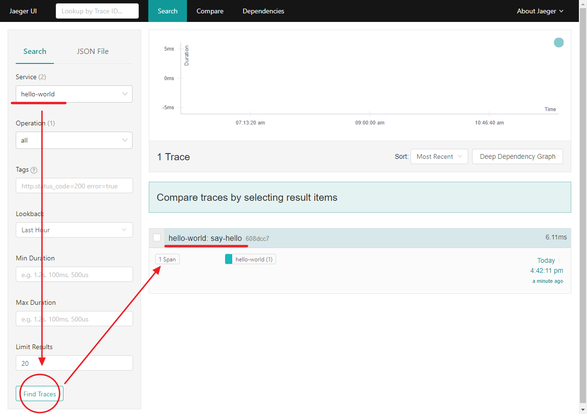
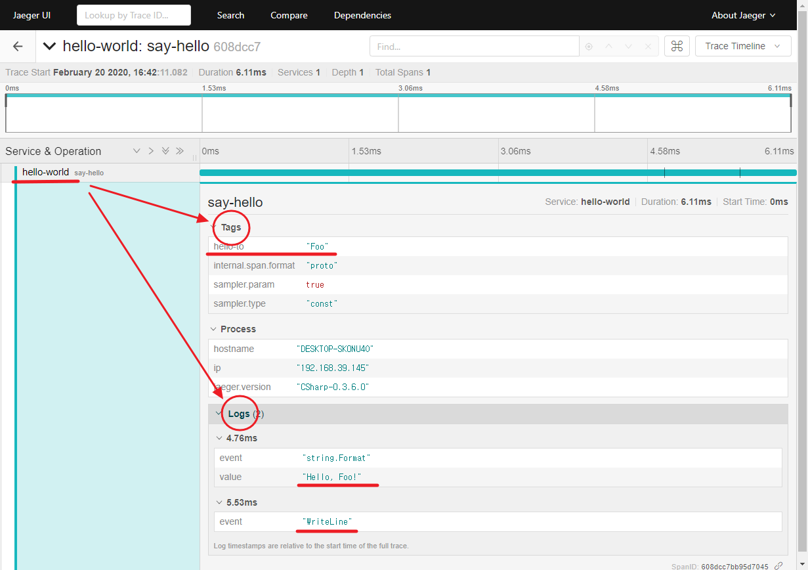

# Lession1 > Step3

## 목표
- Trace 메시지(Jaeger)을 출력한다.

## 배움
- dotnet 프로젝트 참조 명령어
- Jaeger 추적 메시지 출력
  - [ITracer](https://github.com/opentracing/opentracing-csharp/blob/c534179959d4a4160e06456cc70e609f827952e8/src/OpenTracing/ITracer.cs)
  - [ISpan](https://github.com/opentracing/opentracing-csharp/blob/d00349731545c04c989ba138f12e402cbe902208/src/OpenTracing/ISpan.cs)

dotnet add .\Lesson1\Step3\ package Jaeger
dotnet add .\Lesson1\Step3\ package OpenTracing
dotnet add .\Lesson1\Step3\ reference .\LessonLib\

// 192.168.99.201:6831
C:\PoC\Tutorial> dotnet run --project .\Lesson1\Step3\ Foo
info: Jaeger.Configuration[0]
      Initialized Tracer(ServiceName=hello-world, Version=CSharp-0.3.6.0, Reporter=CompositeReporter(Reporters=RemoteReporter(Sender=UdpSender(UdpTransport=ThriftUdpClientTransport(Client=192.168.99.201:6831))), LoggingReporter(Logger=Microsoft.Extensions.Logging.Logger`1[Jaeger.Reporters.LoggingReporter])), Sampler=ConstSampler(True), IPv4=-1062721647, Tags=[jaeger.version, CSharp-0.3.6.0], [hostname, DESKTOP-SK0NU4O], [ip, 192.168.39.145], ZipkinSharedRpcSpan=False, ExpandExceptionLogs=False, UseTraceId128Bit=False)
info: Step3.Hello[0]
      Hello, Foo!
info: Jaeger.Reporters.LoggingReporter[0]
      Span reported: 608dcc7bb95d7045:608dcc7bb95d7045:0:1 - say-hello

- TODO VSCode Using 자동 완성
- TODO VSCode Using 정리하기
- TODO VSCode 빌드 오류일 때 .cs 파일 바로가기(링크)
- TODO VSCode 빌드 단축키
- TODO #if 플랫폼 구분 모든 프로젝트에서 함께 사용하기
- TODO #if 플랫폼 구분 정리